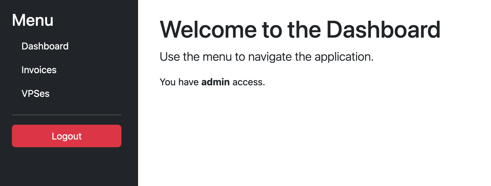

# Example transip vps multi auth application

This mostly AI generated code is a simple multi auth application for a transip vps / invoice management system.

## Users (demo/finance/dev)

### demo (admin)
The demo user has full access to the application.

### finance (finance)
The finance user has limited access to the application.

### dev (dev)
The dev user has limited access to dev servers.
